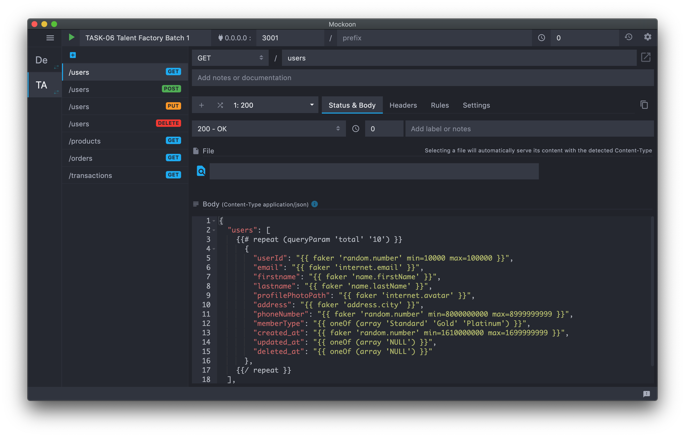

# Task-06 Talent Factory Batch 1

## ERD

[https://dbdiagram.io/d/6003d9ad80d742080a36a3de](https://dbdiagram.io/d/6003d9ad80d742080a36a3de)

### Deskripsi Tabel

### Mock API

Menggunakan Mockoon

Endpoint-endpoint digunakan untuk di-consume di sisi users

Daftar Endpoint diantaranya:

- /users , method yang diijinkan GET, POST

- /users/{id} , method yang diijinkan GET, PUT, DELETE

- /products , method yang diijinkan GET, mendukung query string untuk pencarian berdasarkan kategori, contoh: /user?category=short

- /products/{id} , method yang diijinkan GET

- /orders , method yang diijinkan GET, POST, DELETE

- /transactions, method yang diijinkan GET, POST mendukung query string untuk status transaksi

Endpoint lainnya:

- /registration , POST

- /login , POST

- /logout, POST

- /checkout POST

Membuat dummy data menggunakan faker pada Mockoon (sample)

1. Endpoint Users Method GET
   

### API Documentation

Membuat dokumentasi API menggunakan Postman
