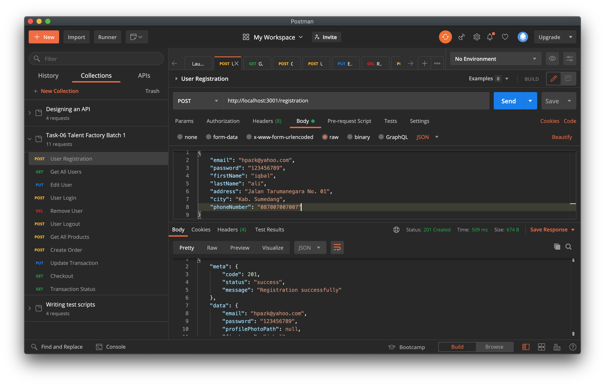

# Task-06 Talent Factory Batch 1

## Studi Kasus

Membangun REST API untuk aplikasi pemesanan Jersey.

### Mini Story Board

- Customer melakukan registrasi untuk mendapatkan akes ke aplikasi, kemudian melihat produk, melakukan pemesanan, dan melakukan checkout pembayaran.
- Owner memiliki akses untuk mengelola data produk, data pesanan, dan data transaksi

### ERD

[https://dbdiagram.io/d/6003d9ad80d742080a36a3de](https://dbdiagram.io/d/6003d9ad80d742080a36a3de)

### Mock API

Menggunakan Mockoon untuk tujuan latihan

Daftar Endpoint diantaranya (sample):

- /users , method yang diijinkan GET, POST

- /users/{id} , method yang diijinkan GET, PUT, DELETE

- /products , method yang diijinkan GET, mendukung query string untuk pencarian berdasarkan kategori, contoh: /user?category=short

- /products/{id} , method yang diijinkan GET

- /orders , method yang diijinkan GET, POST, DELETE

- /transactions, method yang diijinkan GET, POST mendukung query string untuk status transaksi

Endpoint lainnya:

- /registration , POST

- /login , POST

- /logout, POST

- /checkout POST , untuk diintegrasikan dengan payment gateway

Membuat dummy data menggunakan faker pada Mockoon (sample)

Membuat Endpoint Users dengan Method GET
   

Hit Endpoint: GET /users
    

### API Documentation

Membuat dokumentasi API menggunakan Postman (sample)

[https://documenter.getpostman.com/view/6704704/TVzXBuyh](https://documenter.getpostman.com/view/6704704/TVzXBuyh)